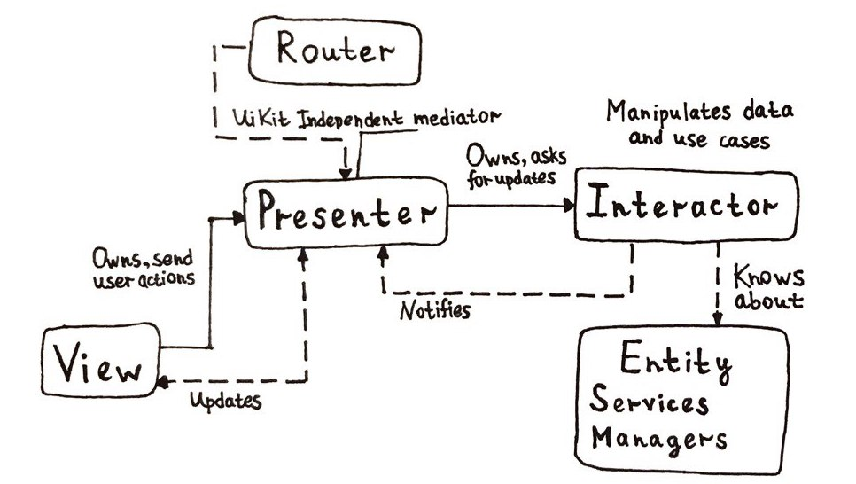

# View-Interactor-Presenter-Entity-Router

VIPER — шаблон проектирования пользовательского интерфейса, который был разработан 
для облегчения автоматического модульного тестирования и улучшения разделения 
ответственности в презентационной логике 

V (View) - Обрабатывает события пользователя. Принимает обновления от Presenter

I (Interactor) - Содержит бизнес-логику обращающуюся к Entity. Для БД, например, является слоем абстракции

P (Presenter) - Принимает события от View. Содержит бизнес логику основанную на View. Вызывает методы Interactor

E (Entity) - Это различные сервисы и менеджеры. Занимаются походом в сеть, запрсоами к бд, и различными конверторами и тд

R (Router) - Ялвяется навигатором между экранами

  

